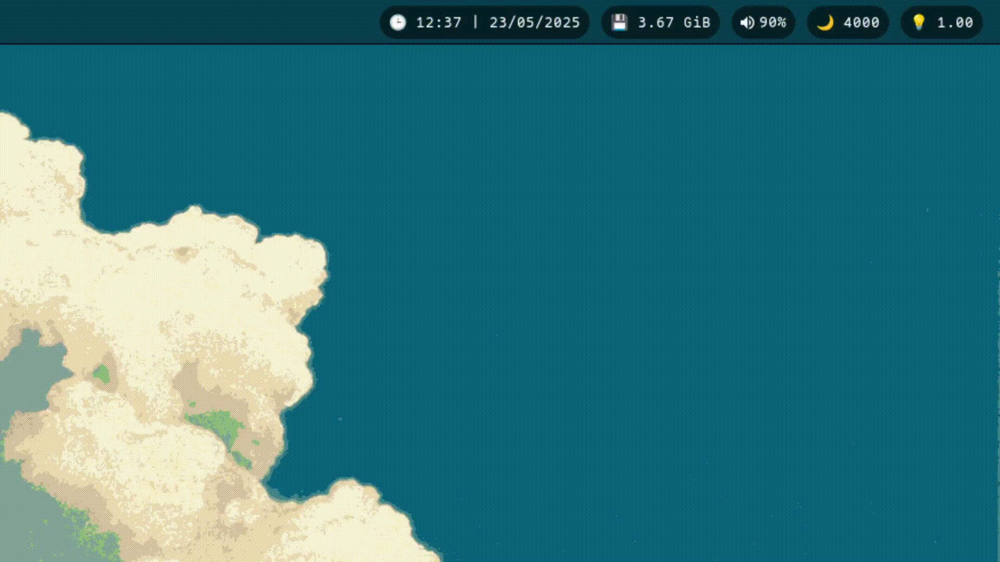
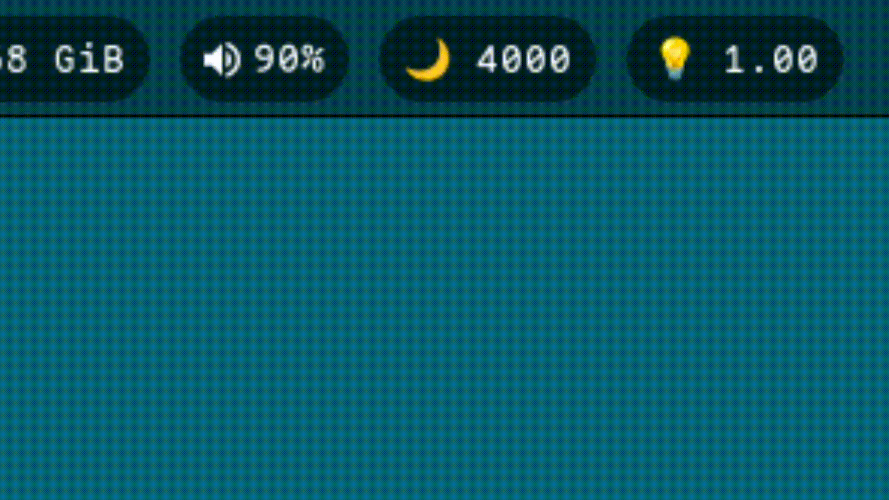

 <html>
  <body>
    <br>
    <p align="center"></p>
    <br>
    <p align="left"></p>
    <p align="right"></p>
    <p align="left"></p>
    <br>
   
   ## 💚 ¡Gracias por pasarte por aquí!
   
   <p>¡Bienvenid@ a mis archivos de configuración de Hyprland!</p>
   <p>En este repositorio encontrarás todos mis archivos de configuración y aprenderás a como solucionar algunos errores que puedan suceder en el proceso.</p>
   <p>Siéntete libre de tomar cualquier cosa de aquí, ¡solo recuerda darme crédito por ello! :)</p>
   <br>
   
   ## ⚠️ Detalles a tener en cuenta
   <ul>
     <li>La instalación realizada, responderá mejor en una máquina física. Las máquinas virtuales suelen dar más problemas en Hyprland excepto con la virtualización KVM.</li>
     <li>El proceso de instalación mediante el script, se debe realizar en un sistema Arch Linux limpio, des de la TTY.</li>
     <li>Antes de iniciar el script para instalar las configuraciones, debes instalar las dependecias y paquetes.</li>
   </ul>
   <br>
   
   ## 🔧 Procedimiento para instalar
   <h4>Para poder instalar y configurar los dotfiles debes seguir los siguientes pasos:</h4>
   <br>
   <p>1️⃣ Instalar dependencias:</p>

   ```sh
    sudo pacman -Syu && git clone https://aur.archlinux.org/yay-git.git && cd yay-git && makepkg -si
   ```
   ❗ Puedes instalar des del archivo requisitos.sh
   
   <p>2️⃣ Instalar paquetes:</p>

   ```sh
    yay -S hyprland kitty wl-clip-persist swaylock-effects sddm-theme-sugar-candy-git &&
    sudo pacman -S rofi sddm zsh lsd bat zsh-syntax-highlighting zsh-autosuggestions swayidle xautolock hyprpaper waybar polkit polkit-gnome nemo pavucontrol slurp grim swappy neofetch megatools wget unzip
   ```
   ❗ Puedes instalar des del archivo requisitos.sh
   
   <p>3️⃣ Descargar repositorio:</p>
   
   ```sh
     git clone https://github.com/f3l3p1n0/bluehypr.git
   ```

   <p>4️⃣ Acceder al directorio bluehypr:</p>

   ```sh
    cd bluehypr
   ```

   <p>5️⃣ Ejecutar el instalador:</p>
   
   ```sh
    bash install.sh
   ```
 
   <p>6️⃣ Deja que finalice la instalación. Posteriormente realizar un reboot.</p>
   <br>
   <p>Te dejo por aquí un vídeo por si quieres realizar la instalación de una forma más guiada: https://youtu.be/4q_DGGN_BWY</p>
   <br>

   ## 📷 ‎Galería
   
   | <b>Powermenu</b>                                                                                     |
   | ---------------------------------------------------------------------------------------------------- |
   | <a href="#--------"></a>    |

   | <b>Workspaces</b>                                                                                    |
   | ---------------------------------------------------------------------------------------------------- |
   | <a href="#--------"></a>   |

   | <b>Calendar</b>                                                                                     |
   | ----------------------------------------------------------------------------------------------------|
   | <a href="#--------"></a>    |

   | <b>Volume</b>                                                                                       |
   | ----------------------------------------------------------------------------------------------------|
   | <a href="#--------"></a>      |

   | <b>Launcher</b>                                                                                     |
   | ----------------------------------------------------------------------------------------------------|
   | <a href="#--------"></a>    |

   <br>
   
   ## ❌ Posibles problemas y soluciones
   <h4>En esta sección se abarcarán los posibles problemas y soluciones que vayan surgiendo:</h4>
   <h5>◻️<ins> El wallpaper no se aplica al iniciar sesión</ins></h5>
   <p>Debes ir a la configuración de hyprpaper: <strong>nano .config/hypr/hyprpaper.conf</strong></p>
   <p>Posteriormente, cambia el nombre del monitor que hay establecido por el nombre de tu monitor</p>
   <p>Para saber el nombre de tu monitor debes escribir en la terminal: <strong>hyprctl monitors</strong></p>
   
   <h5>◻️<ins> El powermenu se visualiza distorsionado o no funciona</ins></h5>
   <p>El powermenu en mi caso, está configurado para que se pueda visualizar correctamente en la resolución 1920x1080. Si en tu caso no lo visualizas correctamente, deberás dirigirte a la siguiente ruta: <strong>cd ~/.config/rofi/powermenu/</strong></p>
   <p>Posteriormente, deberás abrir el archivo <strong>config.rasi</strong></p>
   <p>En este archivo debes modificar la línea: <strong>mainbox-margin</strong> del apartado Global Properties. Ajusta los parámetros a tu gusto, puedes probar con <strong>15px 40px</strong>.</p>
   
   <h5>◻️<ins> Waybar no carga al iniciar sesión</ins></h5>
   <p>Debes abrir la configuración de waybar: <strong>nano .config/waybar/config.jsonc</strong></p>
   <p>En el archivo debes modificar el apartado <strong>output</strong> para cambiar el nombre del monitor.</p>

   <h5>◻️<ins> El powermenu o calendario no aparecen</ins></h5>
   <p>En la configuración de <strong>.config/eww/eww.yuck</strong> debes modificar los valores de :x e :y para posicionar los widgets correctamente. Prueba con :x "0" y :y "0".</p>
   <p>También en la misma configuración "eww.yuck", debes modificar el valor :monitor, ya que puede ser que estén iniciando en otro monitor si es que tienes más de uno.</p>
   <br>
   
   ## 👤 Autor
   <p><a href="https://github.com/f3l3p1n0">f3l3p1n0</a></p> 
  </body>
 </html>
